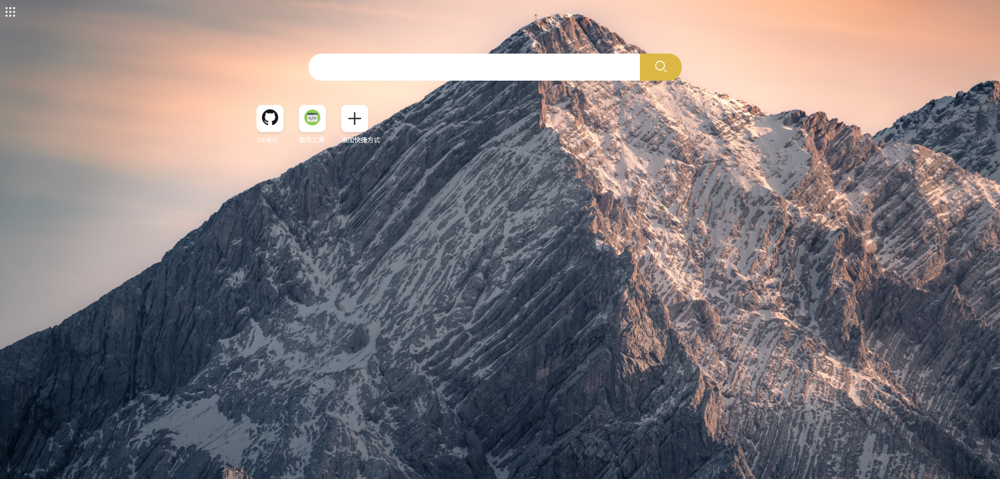
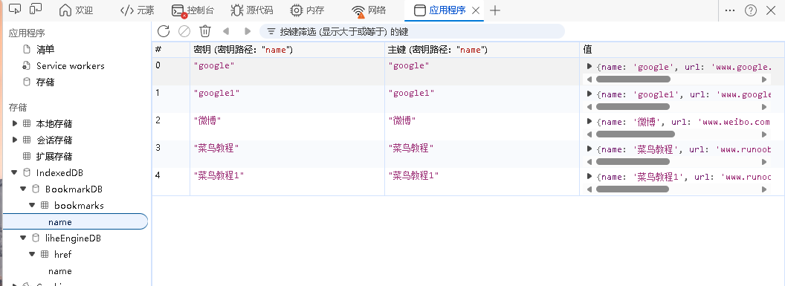

# Lihe Engine

## 介绍💡
Lihe Engine🚀是一个用原生JavaScript打造的导航页，它集成了多个主流搜索引擎🔍，如必应、GitHub🌟（特别优化）、谷歌等，旨在为用户提供一个快速、高效的信息检索入口，同时结合edge插件实现了自定义设置快捷方式的功能

## 优点🎯
- **浏览器数据库**: 利用浏览器的IndexedDB数据库存储用户自定义的搜索引擎快捷方式，确保数据稳定安全可靠。
- **多引擎搜索**: 集成多个搜索引擎，满足不同场景下的信息查询需求。
- **快速访问**: 可设置为浏览器默认首页，一键直达常用网站，提升工作效率。
- **自定义快捷方式**: 支持用户自定义添加搜索引擎快捷方式，方便快捷地访问自己常用的网站。
- **edge插件**: 提供edge插件版本，用户可直接在edge浏览器中安装使用和配置。

## 图片

## 部署❤️
本项目使用GitHub Pages进行部署，无需任何配置即可在线访问。
也可使用docker镜像部署，本项目docker镜像地址为：[https://hub.docker.com/repository/docker/lmliheng/lihe-engine/general](https://hub.docker.com/repository/docker/lmliheng/lihe-engine/general)

## 贡献🤝
我们热烈欢迎社区成员贡献代码、提出建议或报告问题

衷心感谢所有贡献者和用户的宝贵支持与反馈，正是有了你们的参与才能持续进化，变得更好。

本项目遵循*Apache License 2.0*许可协议

如果你对项目有任何疑问或需要技术支持，请随时联系我。我期待与你一起探索无限可能！🌟

## bug

1. 菜单栏 26-3-15  not solved

2. 自定义快捷方式的二次渲染后，会导致添加图标按钮失效  26-3-15  no solved

3. 插件版 26-3-15  not solved